# Codex Agent Framework

Multi-provider orchestration framework coordinating Gemini Flash and Claude Code under OpenAI Codex with fail-closed fallback routing, live quota caching, and process isolation.

[](https://github.com/Clar17y/codex-agent-framework/actions/workflows/tests.yml)
[](LICENSE)

## What this is

This framework integrates external AI developer CLI tools—Google Antigravity (`agy`) and Anthropic Claude Code CLI (`claude`)—into an OpenAI Codex development environment. It routes implementation tasks primarily through Gemini Flash falling back directly to native Luna medium (`gpt-6-luna`), and independent code reviews through Claude Opus 5.5 with native Astra low fallback (restricted to read and search tools, with shell execution, file edits, and MCP excluded). All execution runs through a local Python orchestration runner that coordinates file-level concurrency, caches terminal quota exhaustion, and isolates credentials across child subprocesses. Ownership coordination and quota state are local to one machine and do not coordinate writers across separate computers or network-mounted workspaces.

## Design highlights

- **Deterministic fail-closed fallback chain**: Implementation tasks route primarily to Gemini Flash (`gemini-3.8-flash-medium`) and fall back directly upon quota exhaustion or non-quota failure to native Luna medium (`gpt-6-luna`).
- **Atomic quota caching**: Gemini and Claude quota states are cached atomically with provider reset times or cooldowns. Legacy DeepSeek balance preflight and caching internals are retained for backward compatibility.
- **Subprocess credential isolation**: Credential isolation and artifact redaction are defense in depth, not a hard same-user process-containment boundary.
- **Retained-artifact secret redaction**: Retained execution logs (`prompt.txt`, `stdout.log`, `stderr.log`, `last_message.txt`, `provider.log`, `progress.json`, `heartbeat.json`, `status.txt`, `diff.txt`, `head.txt`) in workspace `.llm-output/` are scanned via full-file memory maps (`mmap`) and rewritten using bounded 64 KB copy chunks with atomic replacement (falling back to single-link in-place rewriting for locked Windows file handles). `result.json` is sanitized separately in memory before being written to disk.
- **Granular path-ownership claims and pending-run locking**: Cooperating implementation workers register hierarchical file or directory paths under a short coordination lock, preventing concurrent conflicting writers on identical or ancestor/descendant files while preserving pending records after abnormal termination until explicit operator resolution. Coordination is local to one machine and does not coordinate writers across computers or network-mounted workspaces.
- **Bounded-memory stream telemetry parsing**: CLI lifecycle events across Gemini (`stream-json`) and Claude (`stream-json`) are parsed using an incremental raw-byte reader in 64 KB chunks up to 1 MB per line, emitting rate-limited stderr progress and evaluating terminal success from a bounded tail buffer without accumulating multi-megabyte transcripts in memory.

## Provider routing chain

```mermaid
flowchart TD
    subgraph Implementation["Implementation Chain"]
        Start["Task: Routine Implementation"] --> PendingCheck{"Unresolved pending run<br/>on claimed paths?"}
        PendingCheck -- "Yes" --> Blocked["Blocked (exit 1 / blocked_pending_run)<br/>Halts until operator resolution"]
        PendingCheck -- "No" --> GeminiCheck{"Check local quota cache"}
        GeminiCheck -- "Available" --> Gemini["Primary: gemini-3.8-flash-medium"]
        GeminiCheck -- "Quota exhausted" --> Luna["Native fallback: native Luna medium (gpt-6-luna)"]

        Gemini -- "Success" --> Done["Done"]
        Gemini -- "Terminal quota exhaustion" --> RecordGemini["Record quota in gemini-quota.json"] --> Luna
        Gemini -- "Non-quota error / failure" --> Luna

        Luna --> Done
    end

    subgraph Review["Review Chain"]
        ReviewStart["Task: Independent Review"] --> ClaudeCheck{"Check local quota cache"}
        ClaudeCheck -- "Available" --> Claude["Primary: claude-opus-5-5"]
        ClaudeCheck -- "Quota exhausted" --> Astra["Native fallback: native Astra low (reviewer)"]

        Claude -- "Success" --> ReviewDone["Done"]
        Claude -- "Terminal quota exhaustion" --> RecordClaude["Record quota in claude-quota.json"] --> Astra
        Claude -- "Non-quota error / failure" --> Astra

        Astra --> ReviewDone
    end
```



## Evidence

The current native roles use GPT-6 Luna for focused work and GPT-6 Sol for complex implementation, planning and correctness checks. Independent review uses Claude Opus 5.5. See the [dated model routing rationale](docs/MODEL_ROUTING.md) for sources, effort choices and evaluation limits.

- **Offline test suite**: 198 unit tests executed across [`scripts/test_provider_runner.py`](scripts/test_provider_runner.py) and [`scripts/test_install.py`](scripts/test_install.py) with 0 failures, 0 errors, and platform-dependent skips. Tests use temporary installation roots and mock CLI processes under `.llm-output/` without consuming provider tokens or live credentials. These offline checks do not prove provider authentication, pinned-model availability, or role discovery in a live Codex host.
- **Continuous integration matrix**: Multi-platform GitHub Actions workflow at [`.github/workflows/tests.yml`](.github/workflows/tests.yml) executing test discovery and git patch whitespace validation across three platforms: `ubuntu-latest`, `windows-latest`, and `macos-latest` on Python 3.11.
- **Release history**: Existing release tags present in the repository include `v4.1.0`, `v4.1.1`, `v4.1.2`, `v4.2.0`, and `v5.0.0`.
- **Historical benchmarks**: Supplied evaluation data from the v3 architecture is preserved in [docs/BENCHMARKS.md](docs/BENCHMARKS.md) as historical reference data; it does not represent measurements of current Gemini or Claude models.

## Install

The Opus 5.5 review route requires **Claude Code 2.1.280 or later**. Check `claude --version`; use `claude update` or the package manager reported by that command to upgrade. If the supported executable is outside PATH, pass its path with the installer's `--claude` option.

Ordinary installation migrates the exact pre-v8 packaged `claude-opus-5` pin to `claude-opus-5-5` while preserving unrelated routing settings and quota state. The v9 migration removes pre-v9 DeepSeek provider entries and retains custom credential names only as filtering metadata. Custom Claude model values remain intact; the review runner requires the exact supported pin and rejects other models. A current-version override is not silently migrated again.

You need **Python 3.11+**, Git, and Codex signed into your account. If Python is missing or older, install a current version from [python.org](https://www.python.org/downloads/) and reopen your terminal.

No `pip install` is needed. You can install from a cloned repository or from a release archive:

1. **Clone the repository**:
   ```bash
   git clone https://github.com/Clar17y/codex-agent-framework.git
   cd codex-agent-framework
   ```
   Alternatively, download the ZIP archive from [Releases](https://github.com/Clar17y/codex-agent-framework/releases), extract it, and open a terminal in the extracted folder.

2. **Execute installation**:
   - **macOS / Linux**:
     ```bash
     python3 --version
     python3 install.py --dry-run
     python3 install.py
     ```
   - **Windows (PowerShell)**:
     ```powershell
     python --version
     python install.py --dry-run
     python install.py
     ```
     Use an explicit Python executable path if `python` does not identify the target 3.11+ interpreter.

3. **Verify installation**:
   Start a **new Codex task after installing**. Ask it to list the available custom agents and confirm that `ask-gemini`, `ask-claude`, and `simplify` are available.

The framework installs twelve roles (see [Repository layout](#repository-layout)). Custom role discovery depends on the Codex host; see [OpenAI's custom-agent documentation](https://learn.chatgpt.com/docs/agent-configuration/subagents). A host without custom-role support must explicitly pass the role's model, effort, and instructions when spawning.

The default installation destination is `~/.codex` (honoring `CODEX_HOME` or `--codex-home /path/to/codex`). Existing files replaced during installation are backed up under `agent-framework/backups/`, and `agent-framework/install-manifest.json` records file hashes and backup paths. Unrelated configurations, roles, skills, and credentials are preserved.

The installer enforces lexical path checks, refusing linked source or target paths (including symlinks and NTFS reparse points) to prevent circular links or synced-folder collisions. If a macOS source directory has a symlinked ancestor, supply its physical path: `python3 install.py --source "$(pwd -P)"`. Choose a physical destination path as well; symlinks inside the Codex directory are prohibited. The installer also inspects `AGENTS.md` before modification, refusing ambiguous, malformed, or reversed policy markers. Installation is not a filesystem-wide transaction and there is no automatic uninstaller; restore from `agent-framework/backups/` if manual recovery is required. An existing `.agent-framework-install.lock` prevents concurrent installations and dry runs. **Stop active framework jobs before upgrading.**

## Provider setup

### Connect external provider CLIs

Install and sign into the **Antigravity CLI (`agy`)** and **Claude Code CLI (`claude`)**, following their official documentation:

- [Antigravity installation and authentication](https://www.antigravity.google/docs/cli/install/)
- [Claude Code quickstart](https://code.claude.com/docs/en/quickstart)

The framework installer does not install provider binaries or transfer authentication credentials. Native roles can be installed even when a provider CLI is absent. Once the provider tools are installed and on your `PATH`, refresh routing:

- **macOS / Linux**:
  ```bash
  command -v agy
  command -v claude
  python3 install.py --refresh-routing
  ```
- **Windows (PowerShell)**:
  ```powershell
  python install.py --refresh-routing
  ```

If a CLI binary is outside your system `PATH`, supply its explicit path:
```bash
python3 install.py --gemini "$HOME/.local/bin/agy" --claude "$HOME/.local/bin/claude"
```

### Legacy provider compatibility

DeepSeek has been retired from active framework routing in v9. Any preexisting user Codex profiles (`deepseek.config.toml`) or environment credentials (`DEEPSEEK_API_KEY`) on your machine remain untouched. Legacy adapter internals and balance verification logic are retained for compatibility, but DeepSeek is no longer configured, offered, or automatically recommended for active tasks.

The installed routing preserves Gemini `gemini-3.8-flash-medium` as primary implementer, falling back directly to native Luna medium (`gpt-6-luna`), Claude `claude-opus-5-5` with medium review effort by default, and native fallback roles (Astra low for review). Installation does not guarantee that these models are activated on your external accounts.

## Command reference and usage

### Provider availability status

Check provider availability and cached quota state without invoking models or creating task contracts:

- **macOS / Linux**:
  ```bash
  framework_root="${CODEX_HOME:-$HOME/.codex}/agent-framework"
  python3 "$framework_root/scripts/provider_runner.py" status --provider gemini --config "$framework_root/routing.json"
  python3 "$framework_root/scripts/provider_runner.py" status --provider claude --config "$framework_root/routing.json"
  ```
- **Windows (PowerShell)**:
  ```powershell
  $frameworkRoot = Join-Path $(if ($env:CODEX_HOME) { $env:CODEX_HOME } else { Join-Path $HOME '.codex' }) 'agent-framework'
  python "$frameworkRoot/scripts/provider_runner.py" status --provider gemini --config "$frameworkRoot/routing.json"
  python "$frameworkRoot/scripts/provider_runner.py" status --provider claude --config "$frameworkRoot/routing.json"
  ```

Exit codes:
- `0` (`available_to_try`): No cached block is active.
- `20` (`fallback_required`): Confirmed quota exhaustion; routes to fallback.
- `1` (`state_error`): Unreadable state; routes to fallback with error disclosed.

Shared state files live in `agent-framework/state/` (`gemini-quota.json`, `claude-quota.json`; legacy `deepseek-balance.json` is retained if present). See [docs/FRAMEWORK.md](docs/FRAMEWORK.md) for details on quota caching.

### Delegated implementation and review execution

Execute tasks via the provider runner:

```bash
# Implementation (Gemini Flash -> Luna medium)
python3 "$framework_root/scripts/provider_runner.py" implement \
  --workspace "$PWD" --task-file "$PWD/.llm-output/task.json" \
  --config "$framework_root/routing.json"

# Review (Claude Opus 5.5, routine medium effort)
python3 "$framework_root/scripts/provider_runner.py" review \
  --workspace "$PWD" --task-file "$PWD/.llm-output/task.json" \
  --config "$framework_root/routing.json"

# Review (Claude Opus 5.5, high effort with justified reason)
python3 "$framework_root/scripts/provider_runner.py" review \
  --workspace "$PWD" --task-file "$PWD/.llm-output/task.json" \
  --config "$framework_root/routing.json" \
  --review-effort high --review-reason "Coupled state machine refactoring and security audit"
```

Review tasks execute with read-only tools: shell execution, file edits, and MCP servers are excluded. On Windows, use `python` and Windows path separators.

### Manual quota entries

Record manually reported quota limits or reset times:

```bash
python3 "$framework_root/scripts/provider_runner.py" quota-set --provider claude \
  --config "$framework_root/routing.json" --reason "User reported exhausted usage"
```

To provide an exact reset time from a usage dashboard, supply `--reset-at` with an ISO-8601 timestamp including timezone offset (e.g. `--reset-at "2026-09-18T18:00:00+00:00"`).

### Updates and recovery

To update from source:

- **macOS / Linux**:
  ```bash
  git pull --ff-only
  python3 install.py --dry-run
  python3 install.py
  ```
- **Windows (PowerShell)**:
  ```powershell
  git pull --ff-only
  python install.py --dry-run
  python install.py
  ```

Updates preserve custom routing configurations. Passing `--refresh-routing` resets `routing.json` from the packaged defaults and rediscovers executables; to update only a specific CLI executable while preserving the rest of your custom routing, pass `--gemini` or `--claude` with the desired path. To restore an overwritten file, look up its snapshot under `agent-framework/backups/` as recorded in `agent-framework/install-manifest.json`. Backups are never deleted automatically.

### Stream telemetry and run artifacts

Gemini and Claude runs stream CLI lifecycle events (`stream-json`). The adapter writes raw stream records to `stdout.log`, emits throttled step/tool transitions on stderr at 15-second intervals, updates a content-minimized `progress.json`, and records periodic `heartbeat.json` snapshots (defaulting to 60 seconds) for quiet-period liveness monitoring.

Progress metadata excludes prompts, model response text, tool parameters, and tool outputs. However, raw child logs (`stdout.log` and `stderr.log`) stored under `.llm-output/agent-framework/` retain complete session streams until post-execution sanitization runs; credential isolation and redaction are defense in depth, not a hard same-user process-containment boundary.

### Offline test execution

Run the offline unit tests from the repository root:

- **macOS / Linux**:
  ```bash
  python3 -m unittest discover -s scripts -p 'test_*.py'
  ```
- **Windows (PowerShell)**:
  ```powershell
  python -m unittest discover -s scripts -p 'test_*.py'
  ```

The test suite runs with simulated mock CLI processes and offline fixtures without network calls or API keys. These offline checks do not prove provider authentication, pinned-model availability, or role discovery in a live Codex host. Machine-specific onboarding, platform differences, and verification notes can be tracked in repository issues or local operational logs.

## Repository layout

| Path | Description |
| --- | --- |
| [`GLOBAL_POLICY.md`](GLOBAL_POLICY.md) | Policy instructions defining provider routing, fallback hierarchies, and agent delegation rules |
| [`install.py`](install.py) | Standalone multi-platform installer and upgrade tool |
| [`routing.example.json`](routing.example.json) | Package default routing template defining provider CLI executables, models, and timeouts |
| [`task-template.json`](task-template.json) | Standard task contract template specifying objective, acceptance criteria, and path ownership |
| `agents/` | Twelve custom agent role definitions (`implementer`, `complex-implementer`, `reviewer`, `quality-gate-max`, `correctness-gate`, `security-reviewer`, `test-engineer`, `planner`, `explorer`, `docs-researcher`, `refactor-auditor`, `verifier`) |
| `skills/` | Custom workflow skills: `ask-gemini/` (implementation delegation), `ask-claude/` (read-only review), and `simplify/` (simplification workflow) |
| `scripts/` | Orchestration runner ([`provider_runner.py`](scripts/provider_runner.py)) and unit tests ([`test_install.py`](scripts/test_install.py), [`test_provider_runner.py`](scripts/test_provider_runner.py)) |
| `docs/` | Architecture rationale ([`ARCHITECTURE.md`](docs/ARCHITECTURE.md)), framework operational policy ([`FRAMEWORK.md`](docs/FRAMEWORK.md)), historical benchmarks ([`BENCHMARKS.md`](docs/BENCHMARKS.md)), and workflow templates |

During installation, the installer merges one managed routing-policy block from `GLOBAL_POLICY.md` into the user's own `AGENTS.md` (bounded by `<!-- BEGIN CODEX MULTI-PROVIDER FRAMEWORK -->` and `<!-- END CODEX MULTI-PROVIDER FRAMEWORK -->`) and preserves surrounding personal instructions and configuration.

## Documentation

- [docs/ARCHITECTURE.md](docs/ARCHITECTURE.md): Comprehensive analysis of the six core architectural decisions (fail-closed routing, monetary preflights, credential isolation, artifact redaction, path ownership, and bounded stream telemetry).
- [docs/FRAMEWORK.md](docs/FRAMEWORK.md): Complete operational routing policy, timeout configurations, and lifecycle diagnostics.
- [docs/BENCHMARKS.md](docs/BENCHMARKS.md): Preserved historical benchmark data from v3 architecture evaluation.

## License

This project is licensed under the MIT License. See [LICENSE](LICENSE) for the full license text.

Copyright (c) 2026 Scott Dyer.
